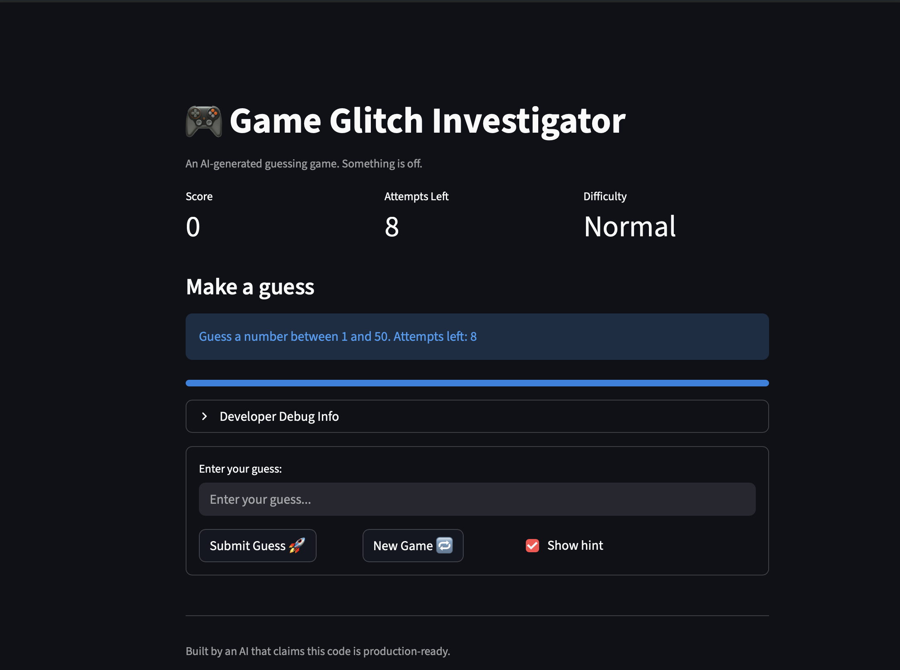
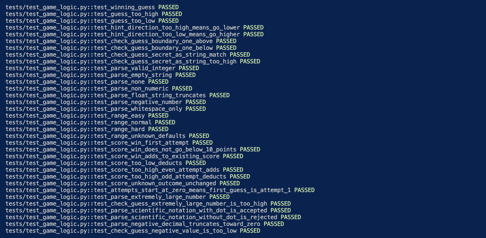

# 🎮 Game Glitch Investigator: The Impossible Guesser

## 🚨 The Situation

You asked an AI to build a simple "Number Guessing Game" using Streamlit.
It wrote the code, ran away, and now the game is unplayable. 

- You can't win.
- The hints lie to you.
- The secret number seems to have commitment issues.

## 🛠️ Setup

1. Install dependencies: `pip install -r requirements.txt`
2. Run the broken app: `python -m streamlit run app.py`

## 🕵️‍♂️ Your Mission

1. **Play the game.** Open the "Developer Debug Info" tab in the app to see the secret number. Try to win.
2. **Find the State Bug.** Why does the secret number change every time you click "Submit"? Ask ChatGPT: *"How do I keep a variable from resetting in Streamlit when I click a button?"*
3. **Fix the Logic.** The hints ("Higher/Lower") are wrong. Fix them.
4. **Refactor & Test.** - Move the logic into `logic_utils.py`.
   - Run `pytest` in your terminal.
   - Keep fixing until all tests pass!

## 🐛 Bugs Fixed

| # | Bug | File | Fix |
|---|-----|------|-----|
| 1 | Hints were backwards — "Go Higher" and "Go Lower" were swapped | `app.py` | Corrected the outcome-to-message mapping so `"Too High"` shows "Go LOWER!" and `"Too Low"` shows "Go HIGHER!" |
| 2 | New Game button did not restart the game | `app.py` | Reset `st.session_state.status` to `"playing"` and cleared `st.session_state.history` in the new game handler |
| 3 | Attempt counter was off by one — Normal mode gave 7 guesses instead of 8 | `app.py` | Initialised `st.session_state.attempts` to `0` instead of `1` |
| 4 | Submit required two clicks before recording a guess | `app.py` | Wrapped input and submit button in `st.form` to batch both into a single rerun |
| 5 | Hints broke on every even-numbered attempt | `app.py` | Always pass the integer secret directly to `check_guess` to prevent string coercion |
| 6 | Info banner always showed range 1–100 regardless of difficulty | `app.py` | Used `low` and `high` from `get_range_for_difficulty` in the banner |
| 7 | Changing difficulty did not reset the secret or the game | `app.py` | Tracked `st.session_state.difficulty` and regenerated the secret whenever the selection changes |
| 8 | Attempts counter displayed one step behind after pressing Submit | `app.py` | Moved `st.session_state.attempts += 1` before the info render using an `st.empty()` placeholder |
| 9 | Normal (1–100) and Hard (1–50) difficulty ranges were swapped | `logic_utils.py` | Corrected to Normal = 1–50, Hard = 1–100 so harder difficulties have a wider search space |

---

## 🔧 What We Built & Improved

### Logic & Code Quality (`logic_utils.py`)
- Added professional Google-style docstrings with `Args`, `Returns`, and `Examples` to all four functions
- Added return type annotations to every function signature
- Renamed single-letter variables (`g`, `s`) to descriptive names (`guess_str`, `secret_str`) for PEP 8 compliance
- Narrowed `except Exception` to `except ValueError` in `parse_guess` for more precise error handling

### UI Improvements (`app.py`)
- **Metric cards** — Score, Attempts Left, and Difficulty displayed as live-updating `st.metric` tiles at the top
- **Progress bar** — drains as attempts are used, giving instant visual feedback on remaining chances
- **Guess history trail** — colour-coded badges below the form (🟢 correct, 🔴 too high, 🔵 too low) so players can track their path at a glance
- **Inline controls** — input field on its own row; Submit, New Game, and Show Hint all on the row below

### Test Suite (`tests/test_game_logic.py`)
- 34 pytest cases covering `check_guess`, `parse_guess`, `get_range_for_difficulty`, and `update_score`
- Edge case tests added for three risky inputs:
  - Extremely large numbers (e.g. `"99999999"`)
  - Scientific notation with a decimal point (e.g. `"2.5e2"` → parses to 250)
  - Negative decimals (e.g. `"-3.7"` → truncates to -3)

---

## 📸 Demo

<!-- Replace the line below with your screenshot once the game is running -->

---

## 🧪 Pytest Results

<!-- Replace the line below with your terminal screenshot after running:  -->
<!-- python3 -m pytest tests/test_game_logic.py -v                        -->

---

## 🚀 Stretch Features

- [ ] [If you choose to complete Challenge 4, insert a screenshot of your Enhanced Game UI here]
